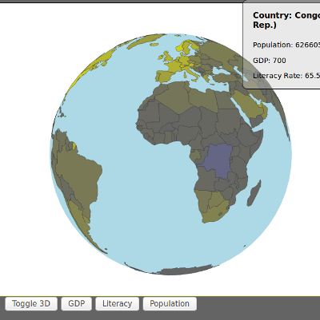
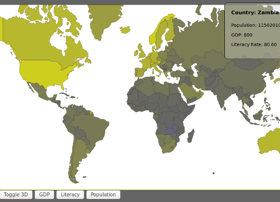

# orthoGlobeApp
An application to visualize statistical data of the world using topojson and d3.js.  Data can be loaded in the form of a csv file and paired with a custom range of values, to be interpolated into a color gradient for best data visualization.  Yellow indicates higher values while grey is lower and blue is lowest.  The current csv data set examines national GDP, literacy rates, and population, as recorded in 2014 reported by the CIA.

This app can run visualized as a 3D globe, allowing the user to click and drag to rotate and reorient.  

2D can be toggles as well, to take a more traditional birds eye view while exploring world data sets.

Check out a live demo in action.
[Link to Live Demo](http://danefrost.com/projects/globeApp/globeApp.php)
